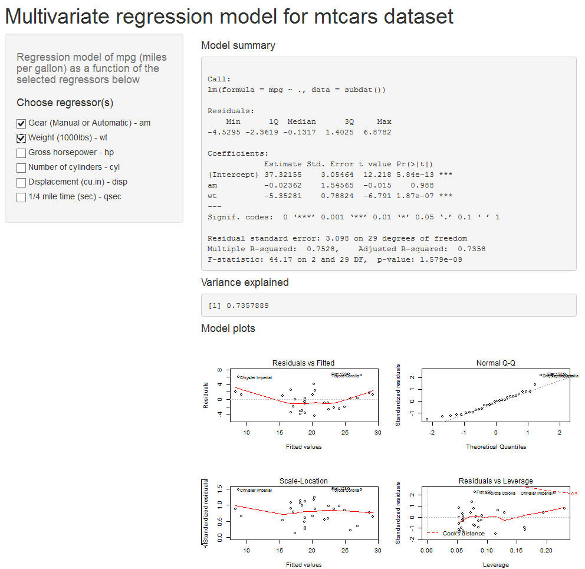

## A Brief Description

- Using the _mtcars_ dataset, an interactive linear regression model describing the dependence of miles per gallon (mpg) variable on other parameters is constructed and implemented in a Shiny app with the number of regressors varied. 

- An user can select different combinations of regressors and examine the effect of the selections on the model characteristics.

- The Shiny app consists of the ui.R and server.R files which should be located in the same directory. An user can run the app with the runApp() command.

--- .class #id 

## Shiny ui.R and server.R Codes

- ui.R contains the header, side, and main panels
    * The side panel includes a checkboxGroupInput with a number of checkboxes for regression variables
    * The main panel includes two text and one plot outputs

- server.R contains the code which performs the following tasks
    * Selecting a subset of data depending on checkbox input
    * Constructing a linear model of mpg as a function of regression variables
    * Creating the text and plot outputs

---  

## Example of A Linear Model with Two Regressors


```r
data(mtcars)
model <- lm(mpg ~ factor(am)+wt,data=mtcars)
summary(model)$coef
```

```
##                Estimate Std. Error     t value     Pr(>|t|)
## (Intercept) 37.32155131  3.0546385 12.21799285 5.843477e-13
## factor(am)1 -0.02361522  1.5456453 -0.01527855 9.879146e-01
## wt          -5.35281145  0.7882438 -6.79080719 1.867415e-07
```

Variance explained


```r
summary(model)$adj.r.squared
```

```
## [1] 0.7357889
```

--- 

## Screen Capture of the Shiny App Run




